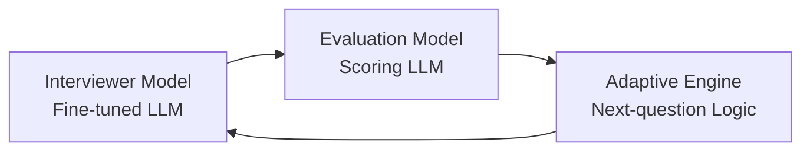
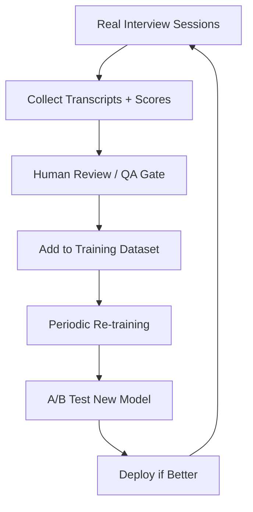
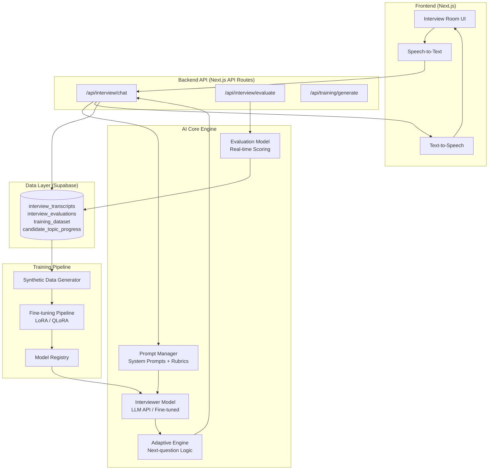

# AI Interviewer Model — Full Architecture & Implementation Plan

## Current State Analysis

Your existing system has two core modules:

| Module | Lines | Approach | Limitation |
|---|---|---|---|
| [interviewAI.ts](file:///C:/Users/Thunder%20Thilak/.gemini/antigravity/scratch/interview-ai/src/lib/interviewAI.ts) | 435 | Static state-machine + hardcoded Question Bank | Cannot generate new questions, no answer analysis |
| [evaluationEngine.ts](file:///C:/Users/Thunder%20Thilak/.gemini/antigravity/scratch/interview-ai/src/lib/evaluationEngine.ts) | 300 | Keyword counting + heuristic scoring | No semantic understanding, no real evaluation |

**The current system is 100% rule-based.** It picks questions from a fixed dictionary and scores answers by counting keywords. This is what we need to replace with a dynamic, intelligent AI system.

---

## Answering Your Questions

### 1. Can we build and train a custom AI model?

**Yes, but with the right approach.** There are two viable paths:

| Approach | Pros | Cons | Recommendation |
|---|---|---|---|
| **Fine-tuned LLM** (e.g. Llama 3, Mistral, Phi-3) | Best interview behavior, generates natural questions | Expensive GPU training, needs 10K+ conversation pairs | ✅ Best long-term |
| **LLM API + Engineered Prompts** (e.g. Gemini, GPT-4, Claude) | Instant quality, no training needed, adaptive out-of-the-box | API costs, vendor dependency | ✅ Best for launch |
| **RL from scratch** | Full control | Needs massive data, years of work | ❌ Overkill |

> [!IMPORTANT]
> **Recommended Strategy: Hybrid approach.** Launch with a prompt-engineered LLM API for the interviewer brain, while simultaneously collecting real interview data. Once you have 10,000+ conversations, fine-tune an open-source LLM to replace the API dependency.

### 2. Can we auto-generate training datasets?

**Yes.** We can build a synthetic data pipeline that generates thousands of interview conversations using an LLM. The pipeline would:
- Generate realistic Q&A conversations across all interview types
- Vary candidate skill levels (beginner / intermediate / expert)
- Include realistic mistakes, partial answers, and follow-ups
- Output structured JSONL files ready for fine-tuning

### 3. What type of model?

The system needs **three models working together**:



| Model | Purpose | Implementation |
|---|---|---|
| **Interviewer Model** | Generates questions, follow-ups, natural conversation | Fine-tuned LLM or prompted API |
| **Evaluation Model** | Scores answers (technical accuracy, communication, confidence) | Prompted LLM with rubric |
| **Adaptive Engine** | Decides what to ask next based on score history | Rule engine + LLM reasoning |

### 4. Dataset Structure

```json
{
  "conversation_id": "conv_001",
  "interview_type": "python",
  "difficulty": "intermediate",
  "candidate_level": "mid",
  "turns": [
    {
      "turn": 1,
      "speaker": "interviewer",
      "text": "Can you explain how Python handles memory management?",
      "intent": "assess_fundamentals",
      "topic": "memory_management",
      "difficulty": "medium"
    },
    {
      "turn": 2,
      "speaker": "candidate",
      "text": "Python uses garbage collection with reference counting...",
      "evaluation": {
        "technical_accuracy": 7,
        "communication_clarity": 8,
        "confidence": 6,
        "completeness": 5,
        "overall": 6.5
      },
      "detected_gaps": ["weak on generational GC", "no mention of __del__"],
      "feedback": "Good understanding of reference counting but missed generational garbage collector details."
    },
    {
      "turn": 3,
      "speaker": "interviewer",
      "text": "You mentioned reference counting. What happens with circular references?",
      "intent": "probe_weakness",
      "topic": "memory_management",
      "difficulty": "hard",
      "adaptation_reason": "Candidate missed generational GC — probing deeper"
    }
  ],
  "final_evaluation": {
    "technical_score": 65,
    "communication_score": 78,
    "coding_score": 72,
    "confidence_score": 60,
    "strong_topics": ["basic_syntax", "data_structures"],
    "weak_topics": ["memory_management", "concurrency"],
    "overall_recommendation": "needs_improvement",
    "detailed_feedback": "..."
  }
}
```

### 5. Synthetic Dataset Generation

**Yes, we will build a generator that produces 5,000–50,000 conversations.** The pipeline works as:

```
Seed Topics × Skill Levels × Interview Types → LLM generates conversation → Validate → Store as JSONL
```

### 6. Continuous Improvement (Online Learning)



### 7. Full System Architecture



---

## Proposed Implementation

### Phase 1: AI Core Engine (Replace static modules)

#### [NEW] `src/lib/ai/promptManager.ts`
Central prompt management system. Contains all system prompts, rubrics, and interview personas. Manages prompt versioning and A/B testing.

#### [NEW] `src/lib/ai/interviewerModel.ts`
Replaces the static [interviewAI.ts](file:///C:/Users/Thunder%20Thilak/.gemini/antigravity/scratch/interview-ai/src/lib/interviewAI.ts). Calls an LLM API (Gemini/OpenAI) with engineered prompts to:
- Generate contextual questions dynamically
- Maintain conversation memory (sliding window)
- Adapt questioning based on real-time evaluation scores
- Handle all interview states (intro → technical → coding → wrap-up)

#### [NEW] `src/lib/ai/evaluationModel.ts`
Replaces the heuristic [evaluationEngine.ts](file:///C:/Users/Thunder%20Thilak/.gemini/antigravity/scratch/interview-ai/src/lib/evaluationEngine.ts). Uses an LLM to:
- Score each answer on a rubric (technical accuracy, communication, confidence, completeness)
- Detect knowledge gaps in real-time
- Generate per-answer and per-session feedback
- Identify strong/weak topics semantically (not just keyword matching)

#### [NEW] `src/lib/ai/adaptiveEngine.ts`
Decides what the interviewer should do next based on:
- Running scores from evaluation model
- Topic coverage so far
- Detected knowledge gaps
- Previous weak topics from Supabase

#### [MODIFY] [src/lib/interviewAI.ts](file:///C:/Users/Thunder%20Thilak/.gemini/antigravity/scratch/interview-ai/src/lib/interviewAI.ts)
Refactor to become a thin wrapper that delegates to the new AI modules while preserving the [InterviewContext](file:///C:/Users/Thunder%20Thilak/.gemini/antigravity/scratch/interview-ai/src/lib/interviewAI.ts#20-31) type for backwards compatibility with the frontend.

#### [MODIFY] [src/lib/evaluationEngine.ts](file:///C:/Users/Thunder%20Thilak/.gemini/antigravity/scratch/interview-ai/src/lib/evaluationEngine.ts)
Refactor to call the new `evaluationModel.ts` while keeping the same [EvaluationResult](file:///C:/Users/Thunder%20Thilak/.gemini/antigravity/scratch/interview-ai/src/lib/evaluationEngine.ts#28-37) interface.

---

### Phase 2: Backend API Routes

#### [NEW] `src/app/api/interview/chat/route.ts`
Server-side API route that handles the interview conversation loop. Receives candidate text, calls the Interviewer Model + Evaluation Model, and returns the AI response.

#### [NEW] `src/app/api/interview/evaluate/route.ts`
Server-side API route for full session evaluation after interview completion.

---

### Phase 3: Synthetic Dataset Generator

#### [NEW] `src/lib/training/datasetGenerator.ts`
Generates synthetic interview conversations using LLM API. Configurable for:
- Interview type, difficulty, candidate skill level
- Number of conversations to generate
- Output format (JSONL for fine-tuning)

#### [NEW] `src/lib/training/datasetSchema.ts`
TypeScript types and Zod schemas for the training dataset format.

#### [NEW] `src/app/api/training/generate/route.ts`
API endpoint to trigger dataset generation (admin-only).

---

### Phase 4: Fine-tuning Pipeline (Future)

#### [NEW] `training/prepare_dataset.py`
Python script to convert JSONL conversations into the format required by the target model (e.g., Llama 3 chat template, Alpaca format).

#### [NEW] `training/finetune.py`
Python fine-tuning script using Hugging Face Transformers + LoRA/QLoRA for parameter-efficient training.

#### [NEW] `training/evaluate_model.py`
Evaluation script that benchmarks model quality against a held-out test set.

---

## User Review Required

> [!IMPORTANT]
> **LLM API Choice**: Which LLM API do you want to use for the interviewer brain?
> - **Google Gemini** (you may already have a key from the Supabase setup)
> - **OpenAI GPT-4o**
> - **Anthropic Claude**
> - **Local model via Ollama** (free but requires GPU)

> [!IMPORTANT]
> **Scope**: Phases 1–3 can be built immediately. Phase 4 (fine-tuning pipeline) requires Python + GPU access and is a separate project. Should I include Phase 4 now, or focus on Phases 1–3 first?

> [!WARNING]
> **Breaking Change**: The new AI modules will replace the static [interviewAI.ts](file:///C:/Users/Thunder%20Thilak/.gemini/antigravity/scratch/interview-ai/src/lib/interviewAI.ts)  logic. The frontend `InterviewRoom` component currently calls [processResponse()](file:///C:/Users/Thunder%20Thilak/.gemini/antigravity/scratch/interview-ai/src/lib/interviewAI.ts#297-425) synchronously — this will need to become `async` since we'll be calling an LLM API. The migration will maintain backwards compatibility through the same [InterviewContext](file:///C:/Users/Thunder%20Thilak/.gemini/antigravity/scratch/interview-ai/src/lib/interviewAI.ts#20-31) types.

---

## Verification Plan

### Automated Tests
1. **Unit tests** for `promptManager.ts` — verify prompt templates render correctly with variables
2. **Unit tests** for `adaptiveEngine.ts` — verify next-question logic produces correct decisions given mock scores
3. **Integration test** for `/api/interview/chat` — send a mock conversation turn and verify the response structure matches expectations

```bash
cd C:\Users\Thunder Thilak\.gemini\antigravity\scratch\interview-ai
npx jest --testPathPattern="src/lib/ai"
```

### Manual Verification
1. **Run the dev server** (`npm run dev`) and start a mock interview session
2. **Verify dynamic questions**: The AI should ask different questions each session, not the same hardcoded ones
3. **Verify answer evaluation**: Give a detailed correct answer → expect high score; give a vague answer → expect low score with feedback
4. **Verify adaptation**: If you answer badly on a topic, the AI should probe deeper before moving on
5. **Test dataset generator**: Hit the `/api/training/generate` endpoint and verify JSONL output
